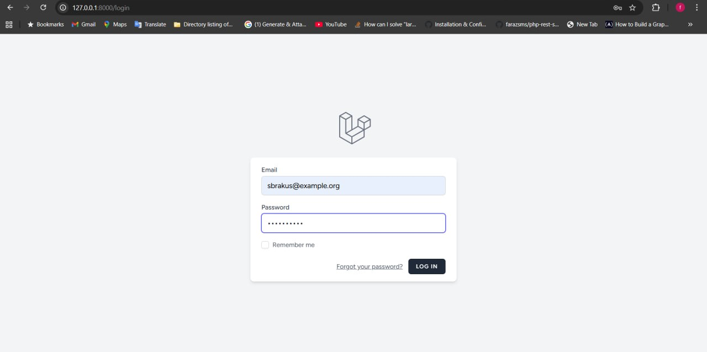
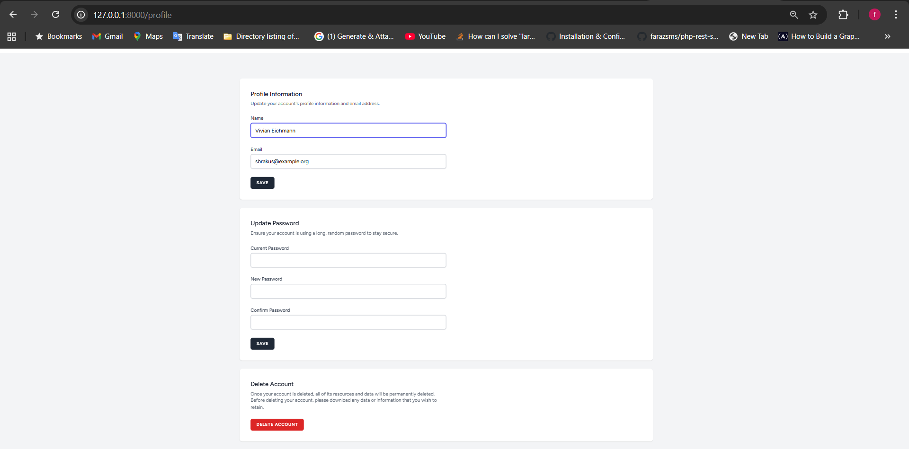
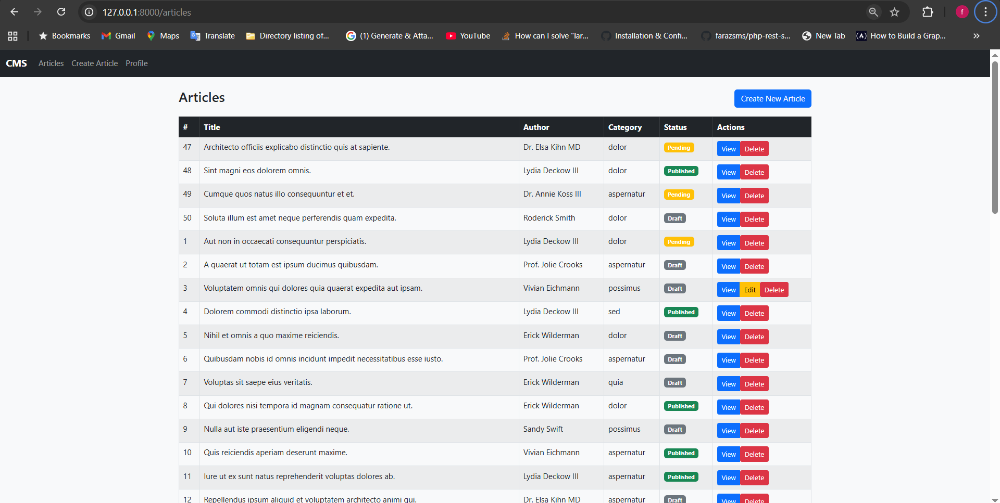
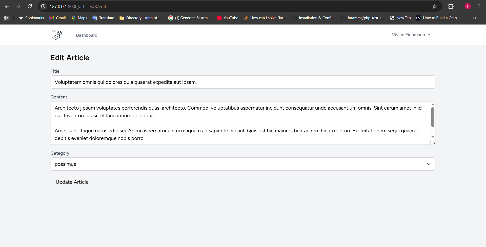
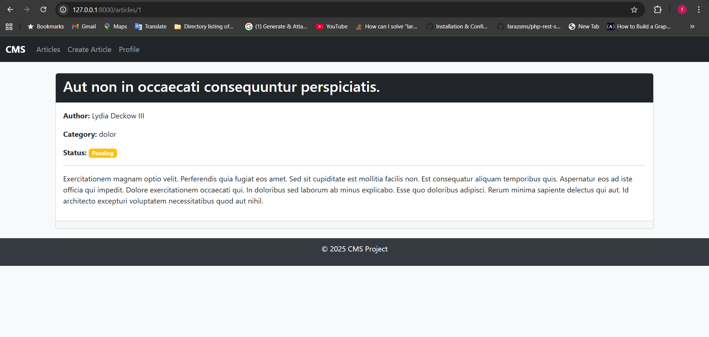
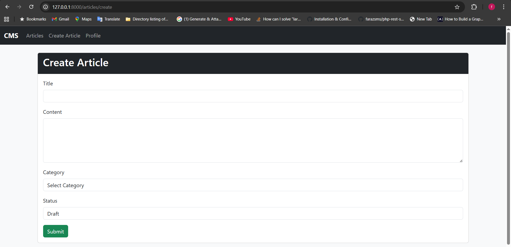
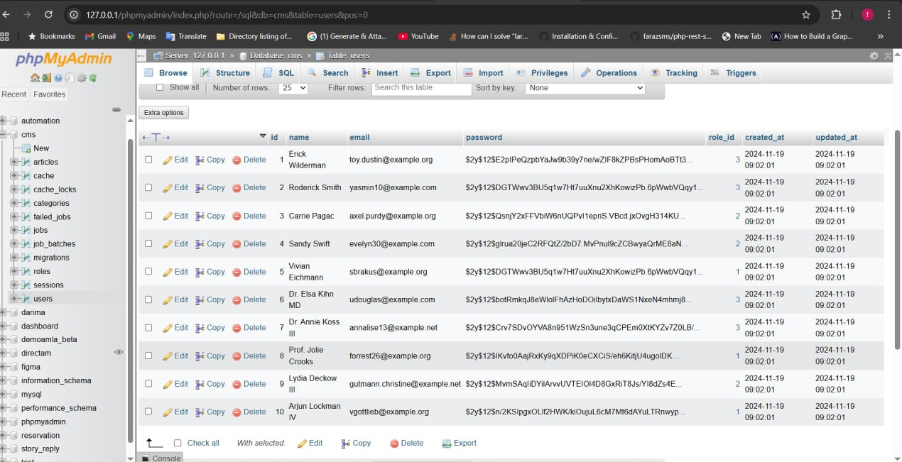

# CMS (Content Management System)

A simple Content Management System built with **Laravel 11** and **PHP 8.2**, featuring user authentication, article management, and a clean Blade-based UI.

## Features
- User authentication (register, login, logout)
- Role-based access control (Admin / User)
- Article management (create, edit, delete, list)
- Blade templates with reusable components
- Database migrations & seeders
- Secure password hashing
- RESTful controllers with Laravel’s MVC architecture

## Tech Stack
- **Framework:** Laravel 11
- **Language:** PHP 8.2
- **Database:** MySQL (via XAMPP)
- **Frontend:** Blade Templates, Bootstrap/Tailwind
- **Tools:** Composer, Artisan CLI, Git

## Installation

1. Clone the repository:
   ```bash
   git clone https://github.com/your-username/cms.git
   cd cms
````

2. Install dependencies:

   ```bash
   composer install
   ```

3. Copy `.env.example` to `.env` and set up your database:

   ```bash
   cp .env.example .env
   ```

   Update these values in `.env`:

   ```env
   DB_CONNECTION=mysql
   DB_HOST=127.0.0.1
   DB_PORT=3306
   DB_DATABASE=cms
   DB_USERNAME=root
   DB_PASSWORD=
   ```

4. Generate application key:

   ```bash
   php artisan key:generate
   ```

5. Run migrations:

   ```bash
   php artisan migrate
   ```

6. Start the development server:

   ```bash
   php artisan serve
   ```

   Your app will be running at: [http://127.0.0.1:8000](http://127.0.0.1:8000)

##  Screenshots


     ## 📸 Screenshots

### Login Page


### Profile Page


### Articles Table


### Edit Article


### View Article


### Create Article


### MySQL Page



